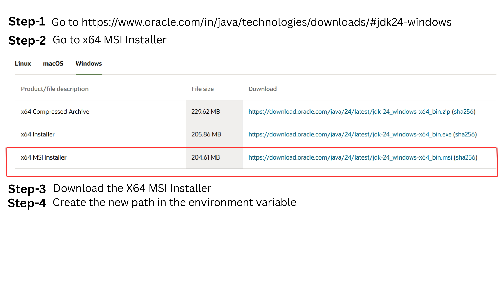
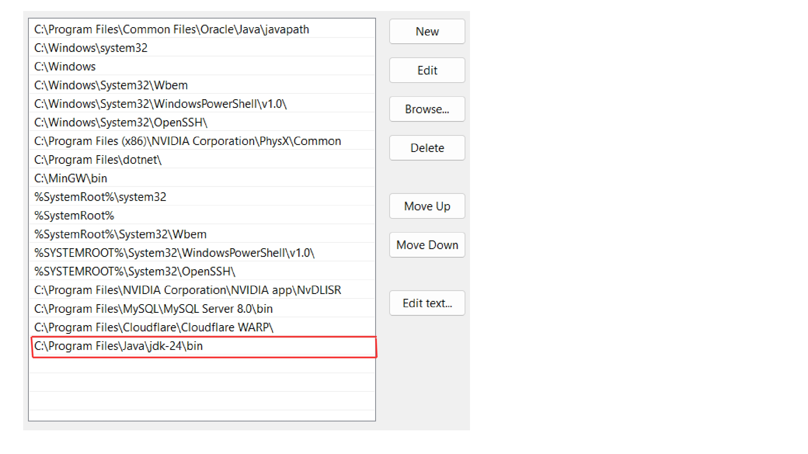
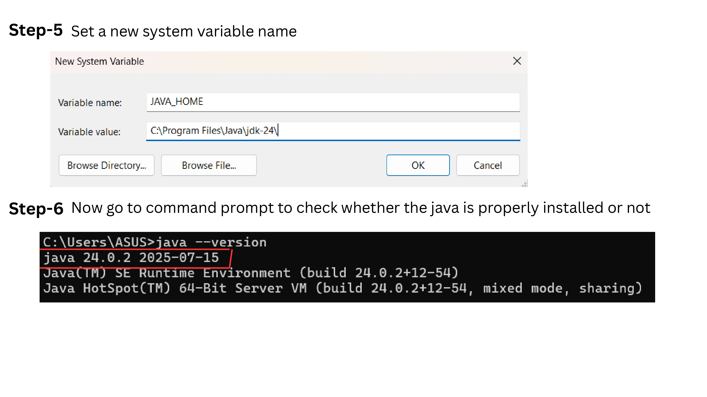

# Java Setup & Platform  

## 1. Evolution of Java (Short Timeline)  

- **1995 – Java 1.0** released by Sun Microsystems.  
- **1997 – Java 1.1** introduces JDBC, inner classes, JavaBeans.  
- **1998 – Java 2 (J2SE, J2EE, J2ME)** splits into SE, EE, ME editions.  
- **2004 – J2SE 5.0** introduces generics, metadata (annotations), enhanced for-loops.  
- **2006 – Java becomes open source** (OpenJDK).  
- **2011 – Java 7** adds try-with-resources, improved concurrency.  
- **2014 – Java 8** introduces lambdas, Streams API, new Date/Time API.  
- **2017 – Java 9** introduces modules (Project Jigsaw).  
- **2021 – Java 17** becomes latest LTS release.  
- **Current – Java 21+** with enhanced performance, records, pattern matching.  

---

## 2. Difference: Java ME vs Java SE vs Java EE  

| Feature          | Java ME (Micro Edition)                               | Java SE (Standard Edition)                            | Java EE (Enterprise Edition)                        |
|-----------------|-------------------------------------------------------|------------------------------------------------------|----------------------------------------------------|
| **Purpose**      | For embedded systems, mobile, IoT devices             | Core Java platform for desktop & server apps         | For large-scale, distributed, enterprise apps      |
| **APIs Included**| Limited API subset for small devices                  | Full core Java APIs (Collections, IO, Networking)    | Adds enterprise APIs (JDBC, Servlets, EJB, JPA)    |
| **Target Devices**| Mobile phones, set-top boxes, smart cards            | Desktops, laptops, small servers                    | Enterprise servers, cloud, web services           |
| **Examples**     | Mobile games, embedded software                      | GUI apps, console apps, small server apps           | Web apps, enterprise backends, distributed systems |
| **Size/Resources**| Optimized for low memory & CPU                        | Moderate resources                                  | High resources, scalable architectures             |

---

## 3. Java Architecture (JDK, JRE, JVM)  

### JDK (Java Development Kit)
Complete package for developers. Contains the JRE + development tools (compiler `javac`, debugger, etc.). Used to **write, compile, and run Java programs**.

### JRE (Java Runtime Environment)
Runtime package that includes JVM + standard class libraries needed to run Java applications. No compiler or dev tools. Used to **run Java apps only**.

### JVM (Java Virtual Machine)
Virtual machine that executes Java bytecode. Converts bytecode into machine-specific instructions. Platform-independent.

---

## Java Program Flow (Compilation & Execution)

```text
Source Code (.java)
   |
   v
javac (Compiler) - from JDK
   |
   v
Bytecode (.class)
   |
   v
JVM (inside JRE)
   |
   v
Machine Code (Executes)
``` 
## 4. Install & Configure Java on Windows  

Follow these steps to install Java on Windows:

1. Download the JDK from the official Oracle/OpenJDK site.  
2. Run the installer and follow the prompts.  
3. Set the JAVA_HOME environment variable and update the PATH.  
4. Verify installation by running `java -version` in Command Prompt.  

### Screenshots  

  

  

  

---

## 5. Using Eclipse IDE  

Follow these steps to create and run a Java project in Eclipse:

1. **Install Eclipse IDE**  
   Download the Eclipse IDE for Java Developers from the official Eclipse website and install it.

2. **Create a New Java Project**  
   - Open Eclipse.
   - Go to `File` → `New` → `Java Project`.
   - Enter the project name and click **Finish**.

3. **Create a Java Class**  
   - Right-click on the `src` folder of your new project.
   - Select `New` → `Class`.
   - Enter the class name (e.g. `Main`) and check **public static void main(String[] args)**.
   - Click **Finish**.

4. **Write Your Code**  
   - Add your Java code in the opened class file.

5. **Run the Program**  
   - Click the green **Run** button in the toolbar or press `Ctrl + F11`.

### Screenshots  

  

  

  
